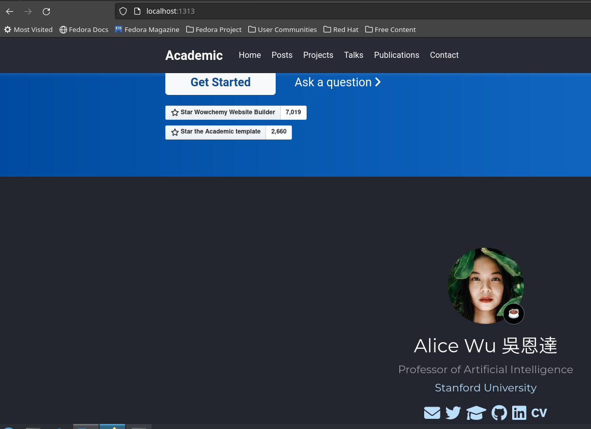

---
## Front matter
lang: ru-RU
title: Первый этап индивидуального проекта
subtitle: Операционные системы
author:
  - Бадалов Заури,.
institute:
  - Российский университет дружбы народов, Москва, Россия
date: 08.09.2024

## i18n babel
babel-lang: russian
babel-otherlangs: english

## Formatting
mainfont: PT Serif
romanfont: PT Serif
sansfont: PT Sans
monofont: PT Mono
toc: false
slide_level: 2
theme: metropolis
header-includes: 
 - \metroset{progressbar=frametitle,sectionpage=progressbar,numbering=fraction}
 - '\makeatletter'
 - '\beamer@ignorenonframefalse'
 - '\makeatother'
aspectratio: 43
section-titles: true

---

## Актуальность

Научному работнику полезно иметь сайт-портфолио про него и его проекты.

## Цель

Научиться размещать сайт на Github pages. Выполнить первый этап реализации индивидуального проекта.

## Задачи

1. Установить необходимое ПО
2. Скачать шаблон темы сайта
3. Разместить его на хостинге Git
4. Установить параметр для URLs сайта
5. Разместить заготовку сайта на Github pages.

## Выполнение первого этапа проекта

Получаем страницу сайта на локальном сервере (рис. 1).

## Установка параметр для URLs сайта

Создаю новый пустой репозиторий, чье имя будет адресом сайта 

## Установка параметр для URLs сайта

Подключаю репозиторий к каталогу public (рис. 2).

## Размещение заготовку сайта на Github pages.

Проверяю есть ли подключение между public и репозиторием zbadalov.github.io, после чего отправляю изменения на глобальный репозиторий.

## Результаты и выводы

- Научился размещать сайт на Github pages
- Разместил шаблон сайта на сервере

# Спасибо за внимание
