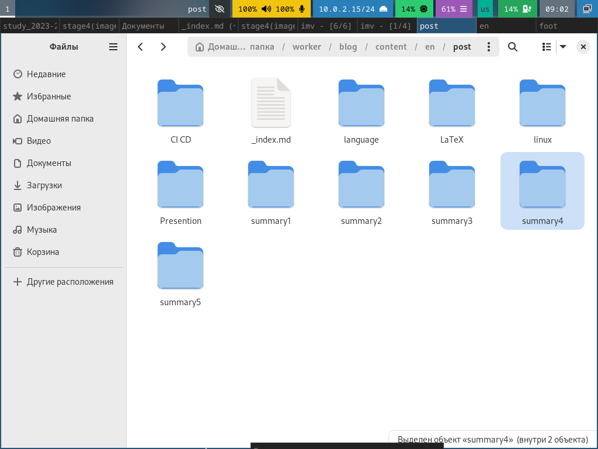
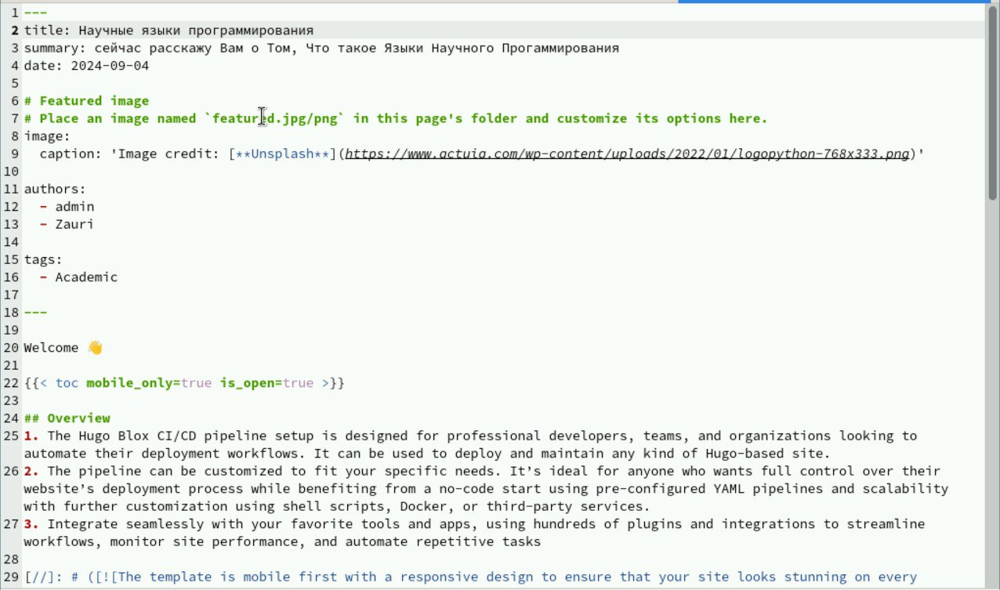
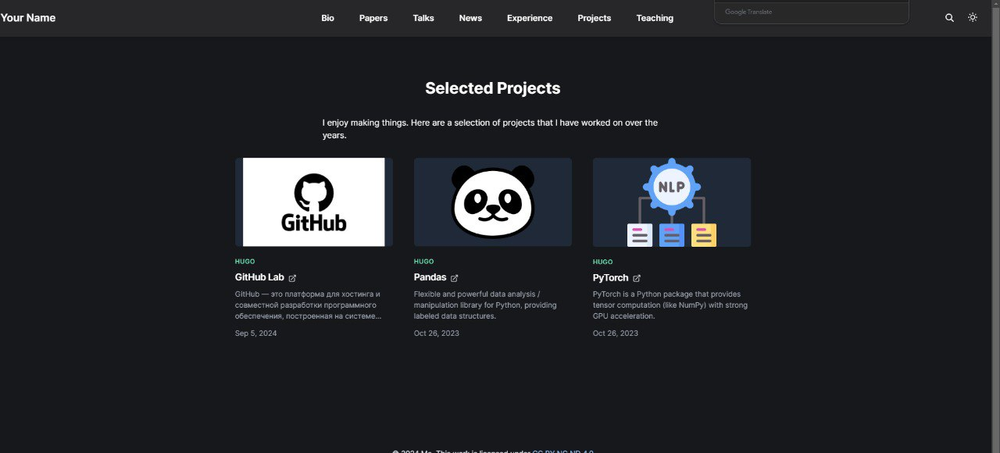
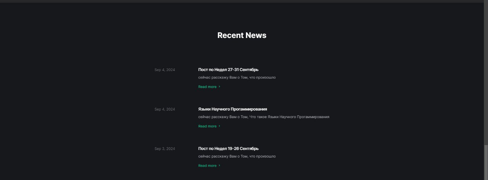

---
## Front matter
lang: ru-RU
title: Индивидуальный проект
subtitle: Часть 5
author:
  - Бадалов Заури,.
institute:
  - Российский университет дружбы народов, Москва, Россия
date: 12 марта 2024

## i18n babel
babel-lang: russian
babel-otherlangs: english

## Formatting
mainfont: PT Serif
romanfont: PT Serif
sansfont: PT Sans
monofont: PT Mono
toc: false
slide_level: 2
theme: metropolis
header-includes: 
 - \metroset{progressbar=frametitle,sectionpage=progressbar,numbering=fraction}
 - '\makeatletter'
 - '\beamer@ignorenonframefalse'
 - '\makeatother'
aspectratio: 43
section-titles: true
---

# Информация

## Докладчик

:::::::::::::: {.columns align=center}
::: {.column width="70%"}

  * Бадалов Заури
  * студент из группы НMMбд-01-23
  * Факультет физико-математических и естественных наук
  * Российский университет дружбы народов
  * [1132236098@rudn.ru](mailto:1132236098@rudn.ru)
  * <https:///zbadalov.github.io>

:::
::: {.column width="30%"}

:::
::::::::::::::

## Цель

Создать индивидуальный сайт, постепенно его заполняя

## Задачи

Добавить с сайту все остальные элементы

## Оформление проекта

Добавим в файле index.md нашего проекта ссылку на гитхаб

## Пост о прошедшей неделе

Напишем пост о прошедшей неделе 

{height=70%}

## Пост про научные языки программирования

Напишем пост про научные языки программирования

{height=70%}

## Вид проектов на сайте

Так выглядят наши проекты на сайте

{height=70%}

## Вид постов

Так выглядят посты

{height=70%}

## Выводы

В результате работы были добавлены проекты
